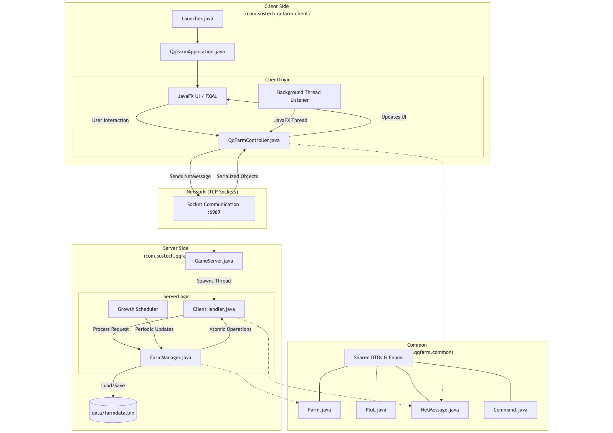
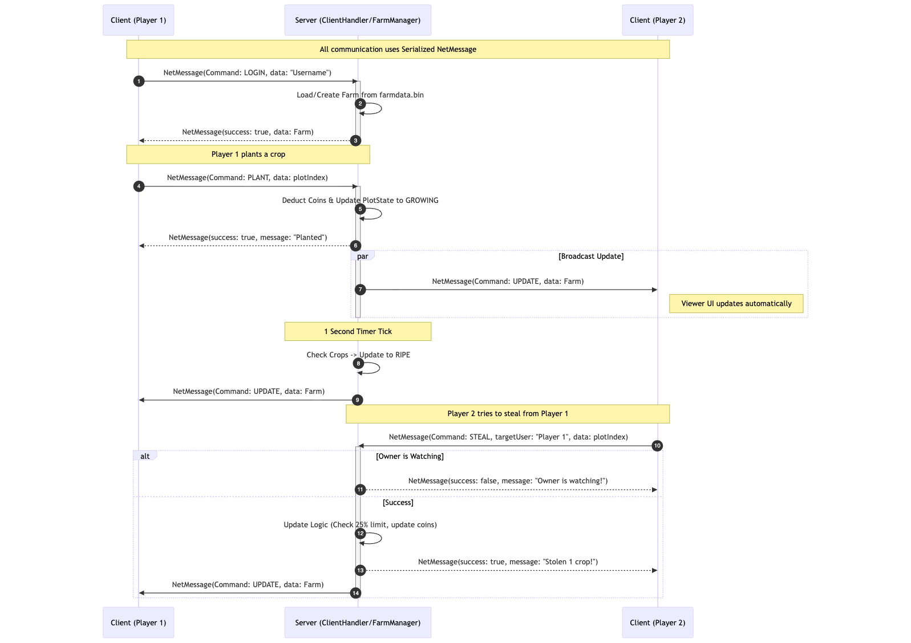

# 🌾 QQ-Farm

QQ-Farm is a simple multiplayer farming game inspired by classic social games. Players can plant crops, harvest them for
coins, visit friends' farms, and steal ripe crops under certain conditions. The game uses a client-server architecture
with JavaFX for the graphical user interface and socket-based communication for multiplayer interactions.

## 🏗️ Architecture

QQ-Farm follows a client-server architecture to support multiplayer features like visiting farms and stealing crops. The
system is divided into three main packages: `server`, `client`, and `common`.



### 🗄️ Server Side (`com.sustech.qqfarm.server`)

- **`GameServer.java`**: The entry point for the server. It listens for client connections on port 6969, uses a thread
  pool to handle clients, and schedules periodic crop growth updates (every second).
- **`ClientHandler.java`**: Handles individual client connections in separate threads. Processes incoming `NetMessage`
  requests (e.g., `LOGIN`, `PLANT`, `HARVEST`, `STEAL`) and sends responses. Ensures thread-safety for concurrent
  operations.
- **`FarmManager.java`**: Singleton managing all farms. Handles core game logic:
    - Farm creation/loading/saving (persistent storage in `farmdata.bin`).
    - Atomic operations for planting, harvesting, and stealing (using synchronization to prevent race conditions, e.g.,
      double-stealing).
    - Tracks player views (which farm a player is viewing) and notifies viewers of updates.
    - Manages steal history to enforce a 25% theft limit per thief per ripe batch.
    - Periodic growth updates to transition plots from `GROWING` to `RIPE`.

### 💻 Client Side (`com.sustech.qqfarm.client`)

- **`QqFarmApplication.java`** and **`Launcher.java`**: JavaFX application entry points. Load the FXML UI and styles.
- **`QqFarmController.java`**: Controls the UI:
    - Connects to the server via sockets and handles login.
    - Renders the farm grid (plots, crops, decorations) with animations (e.g., crop growth, coin changes).
    - Listens for server updates in a background thread and updates the UI on the JavaFX thread.
    - Handles user interactions (plant, harvest, steal, visit) by sending `NetMessage` commands.
    - Supports disconnection/reconnection and visual feedback (e.g., grayscale on disconnect, farmer animation when
      owner is watching).

### 📦 Common (`com.sustech.qqfarm.common`)

Shared classes for data serialization and enums:

- **`Farm.java`**: Represents a player's farm with coins, plots, and steal history.
- **`Plot.java`**: Individual plot with state (`EMPTY`, `GROWING`, `RIPE`, `STOLEN`) and planted time.
- **`PlotState.java`**: Enum for plot states.
- **`Command.java`**: Enum for actions (`LOGIN`, `PLANT`, `HARVEST`, `STEAL`, `GET_FARM`, `GET_PLAYERS`, `UPDATE`).
- **`NetMessage.java`**: Serializable DTO for all client-server communication, containing command, success flag,
  message, data, and metadata.

### ⭐ Key Features

- **Concurrency**: Server uses `synchronized` blocks and `ConcurrentHashMap` for thread-safe operations. Tested via
  `StealConcurrencyTest.java`.
- **Persistence**: Farms are saved/loaded using object serialization.
- **UI**: JavaFX with FXML for layout, CSS for styles, and animations for visual feedback.
- **Modularity**: Configured as a Java module requiring JavaFX.

## 📡 Protocol Description

Communication between client and server uses serialized `NetMessage` objects over TCP sockets. All messages are
instances of `NetMessage`, which includes:

- **`Command`**: The action type (e.g., `LOGIN`, `PLANT`).
- **`success`**: Boolean indicating if the operation succeeded.
- **`message`**: String for status or error messages.
- **`data`**: Object for payload (e.g., `Farm`, `Integer` for plot index, `List<String>` for players).
- **`targetUser`**: String for the target farm owner (e.g., for `STEAL` or `GET_FARM`).
- **`userCoins`**: Integer for the requester's coin balance (always attached to responses).
- **`ownerWatching`**: Boolean indicating if the farm owner is currently viewing their own farm.



### 🔄 Message Flow

1. **Client → Server**: Send `NetMessage` with command and data.
2. **Server → Client**: Respond with updated `NetMessage` (e.g., updated Farm).
3. **Server Broadcasts**: Uses `notifyFarmViewers` to push `UPDATE` messages to all viewers of a farm when changes
   occur (e.g., growth, steal).

### 🛠️ Supported Commands

- **`LOGIN`**: Client sends username. Server creates/loads farm and responds with `Farm`.
- **`GET_FARM`**: Client requests a farm (own or friend's). Server responds with `Farm` and watching status.
- **`PLANT`**: Client sends plot index. Server deducts coins, updates plot to `GROWING`, notifies viewers.
- **`HARVEST`**: Client sends plot index. Server adds coins if `RIPE` (or cleans if `STOLEN`), notifies viewers.
- **`STEAL`**: Client sends plot index and target user. Server checks conditions (not watching, limit), updates
  states/coins, notifies viewers.
- **`GET_PLAYERS`**: Client requests list of other players. Server responds with list.
- **`UPDATE`**: Server pushes farm updates (e.g., growth) to viewers.

### ⚠️ Error Handling

- Responses include error messages (e.g., "Not enough coins", "Owner is watching!").
- Client handles disconnections by disabling UI and allowing reconnection.

## 🚀 Getting Started

### 📋 Prerequisites

- **Java 17 or higher** (the project is configured for Java 17).
- **Maven** (for building the project).
- The project uses JavaFX, so ensure your environment supports it (e.g., OpenJDK with OpenJFX or a JavaFX-compatible
  JDK).

### 🔨 Building the Project

1. **Clone the repository:**
   ```bash
   git clone https://github.com/Layheng-Hok/QQ-Farm.git
   cd QQ-Farm
   ```

2. **Build the project using Maven:**
   ```bash
   mvn clean package
   ```
   This will compile the code, run tests (including concurrency tests), and package the JAR file.

### 🖥️ Running the Server

The server manages game state, handles client requests, and periodically updates crop growth.

1. **Run the server:**
   ```bash
   java -cp target/QQ-Farm-1.0-SNAPSHOT.jar com.sustech.qqfarm.server.GameServer
   ```
    - The server listens on port **6969**.
    - Game data is persisted in `data/farmdata.bin` (loaded on startup and saved on changes).

### 🎮 Running the Client

The client is a JavaFX application that connects to the server.

1. **Run the client using Maven** (recommended for JavaFX module handling):
   ```bash
   mvn javafx:run
   ```

   **Alternatively, run directly:**
   ```bash
   java --module-path <path-to-javafx-libs> \
        --add-modules javafx.controls,javafx.fxml \
        -cp target/QQ-Farm-1.0-SNAPSHOT.jar com.sustech.qqfarm.client.Launcher
   ```
   *Note: Replace `<path-to-javafx-libs>` with the path to your JavaFX SDK lib directory (
   e.g., `/path/to/javafx-sdk-17/lib`).*

2. On launch, enter a username in the login dialog.
3. Multiple clients can be run to simulate multiplayer (e.g., open multiple terminal windows).

